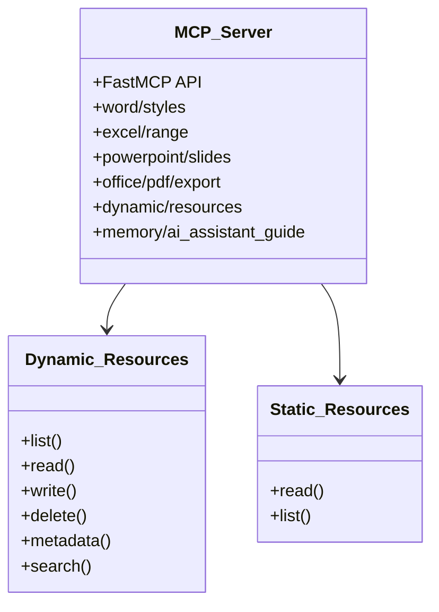
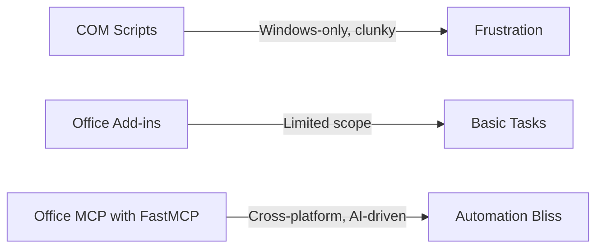
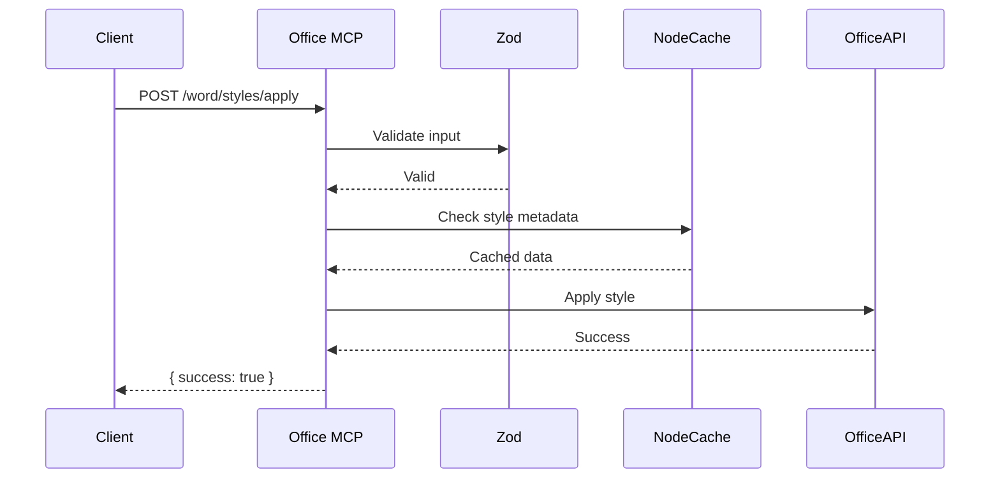

```mermaid
graph TD
  A[Word Use Cases] --> B[Markdown Export]
  A --> C[Merge Documents]
  A --> D[Create Template]
  A --> E[Markdown Import]
  A --> F[Reformat]
  A --> G[Extract Embedded]
  A --> H[Mermaid Import]
  A --> I[Mermaid Export]
  A --> J[Analyze]
  A --> K[Code Format]
  B -->|Save the wiki!| L[CV.md]
  C -->|End the chaos!| M[merged.docx]
  K -->|Code party!| N[Formatted.docx]
  A --> O[Image Insert]
  A --> P[AI Text Gen]
  A --> Q[URI Styling]
  A --> R[AI Analysis]
  A --> S[Code Styling]
  A --> T[Multimodal Illustration]
  O -->|Meme magic!| U[ReportWithCat.docx]
  P -->|Beat writer's block!| V[NovelFinished.docx]
  Q -->|Precision styling!| W[StyledParagraph5.docx]
  R -->|Smart comments!| X[CommentedDoc.docx]
  S -->|Pretty code!| Y[StyledCodeDoc.docx]
  T -->|Visual flair!| Z[IllustratedReport.docx]
```

mcp-office
==========
Office MCP AI server for Microsoft Office automation.

----

# Office MCP Server: Supercharge Your Office Automation with AI 🚀

Welcome to the **Office MCP Server**, your one-stop shop for automating Microsoft Office like a wizard wielding a magic wand! Built with **FastMCP** in TypeScript, this server unleashes a treasure trove of tools to tame Word, Excel, and PowerPoint. From tweaking styles to rendering Mermaid diagrams, merging documents, or exporting to PDF, Office MCP does it all with a dash of AI flair. Whether you're a developer wrangling reports or an AI agent dreaming of document domination, Office MCP is your ticket to Office nirvana.

Why Office MCP? Forget the soul-crushing grind of manual Office tasks or wrestling with outdated COM scripts. Office MCP offers:
- **Granular Control**: Fiddle with every paragraph, table, or embedded object like a pro.
- **AI Superpowers**: FastMCP’s prompt system lets AI suggest styles, resolve conflicts, or even format code like it’s starring in a tech rom-com. Leverages advanced FastMCP features like `instructions`, `annotations`, `reportProgress`, `imageContent`/`audioContent`, `addPrompt`, and `requestSampling` for sophisticated AI interactions.
- **Cross-Platform Glory**: Works with Office 365, desktop Office, and even Power Automate for workflow wizardry.
- **Developer Love**: Type-safe, modular, and documented to make your coding sessions feel like a sunny day at the beach. Includes features like `addResourceTemplate` for easy extension.
- **Rock-Solid**: >90% test coverage means it’s ready for your wildest automation adventures. Includes basic `authenticate` support.

This README is your map to Office MCP mastery. Hit the **Quick Start** for instant action, then explore the **API Documentation**, **Word Use Cases** (with a side of humor), **Excel Use Cases**, **PowerPoint Use Cases**, **Cross-Application Use Cases**, and **AI Interaction** for the full scoop. Let’s make Office automation fun again! 🎉

---

## Table of Contents
1. [Why Office MCP?](#why-mcp)
2. [Quick Start](#quick-start)
   - [Installation](#installation)
   - [Running the Server](#running-the-server)
   - [Basic Examples](#basic-examples)
3. [API Documentation](#api-documentation)
   - [Resource Structure](#resource-structure)
   - [File System Tools](#file-system-tools)
   - [Word Tools](#word-tools)
   - [Excel Tools](#excel-tools)
   - [PowerPoint Tools](#powerpoint-tools)
   - [Cross-Application Tools](#cross-application-tools)
   - [Static and Dynamic Resources](#static-and-dynamic-resources)
4. [Word Use Cases (with a Chuckle)](#word-use-cases-with-a-chuckle)
   - [Use Case 1: Markdown Magic](#use-case-1-markdown-magic)
   - [Use Case 2: Merge Mayhem](#use-case-2-merge-mayhem)
   - [Use Case 3: Template Trickery](#use-case-3-template-trickery)
   - [Use Case 4: Markdown Import Mania](#use-case-4-markdown-import-mania)
   - [Use Case 5: Reformatting Rescue](#use-case-5-reformatting-rescue)
   - [Use Case 6: Embedded Object Extraction Extravaganza](#use-case-6-embedded-object-extraction-extravaganza)
   - [Use Case 7: Embedded Object Insertion Innovation](#use-case-7-embedded-object-insertion-innovation)
   - [Use Case 8: Embedded Object Modification Magic](#use-case-8-embedded-object-modification-magic)
   - [Use Case 9: Embedded Object Deletion Duty](#use-case-9-embedded-object-deletion-duty)
   - [Use Case 10: Mermaid Import Marvel](#use-case-10-mermaid-import-marvel)
   - [Use Case 11: Mermaid Export Escapade](#use-case-11-mermaid-export-escapade)
   - [Use Case 12: Analysis Antics](#use-case-12-analysis-antics)
   - [Use Case 13: Code Formatting Fiesta](#use-case-13-code-formatting-fiesta)
   - [Use Case 14: Instant Image Injection](#use-case-14-instant-image-injection)
   - [Use Case 15: AI Ghostwriter for the Win](#use-case-15-ai-ghostwriter-for-the-win)
   - [Use Case 16: Surgical Strike Styling with URIs](#use-case-16-surgical-strike-styling-with-uris)
   - [Use Case 17: The AI Word Analyst (Goodbye, Manual Reviews!)](#the-ai-word-analyst-goodbye-manual-reviews)
   - [Use Case 18: The Code Stylist in Word](#the-code-stylist-in-word)
   - [Use Case 19: The Multimodal Illustrator](#the-multimodal-illustrator)
5. [Excel Use Cases (with a Smile)](#excel-use-cases-with-a-smile)
   - [The Excel Accountant with Judgment](#the-excel-accountant-with-judgment)
   - [The Express Excel Exporter](#the-express-excel-exporter)
6. [PowerPoint Use Cases (with Festive Cheer)](#powerpoint-use-cases-with-festive-cheer)
   - [The Christmas PowerPoint Decorator (Ho ho ho!)](#the-christmas-powerpoint-decorator-ho-ho-ho)
7. [Cross-Application Use Cases](#cross-application-use-cases)
   - [The Document Multitasker](#the-document-multitasker)
   - [The Magical Office Linker](#the-magical-office-linker)
   - [The PowerPoint Embedder](#the-powerpoint-embedder)
   - [The AI Document Creator](#the-ai-document-creator)
   - [The Universal Office Translator](#the-universal-office-translator)
8. [Interacting with an AI Using Office MCP](#interacting-with-an-ai-using-mcp)
   - [Example 1: Merging Documents](#example-1-merging-documents)
   - [Example 2: Formatting Code](#example-2-formatting-code)
9. [Implementation Details](#implementation-details)
   - [Why TypeScript and FastMCP?](#why-typescript-and-fastmcp)
   - [Dependency Choices](#dependency-choices)
   - [Security and Performance](#security-and-performance)
     - [The Credential Guardian](#the-credential-guardian)
10. [Testing and Reliability](#testing-and-reliability)
11. [Future Improvements](#future-improvements)
    - [The Compressed File Manager (ZIP)](#the-compressed-file-manager-zip)
12. [Useful Links](#useful-links)
13. [License](#license)

---

## Why Office MCP?

Picture this: You’re drowning in a sea of Word documents, Excel spreadsheets, and PowerPoint slides, with your boss demanding a polished report by EOD. Manual editing? A nightmare. Legacy COM scripts? A time machine to 1999. Office add-ins? Cute, but limited. Enter **Office MCP**, the superhero of Office automation:
- **Unrivaled Power**: Control every nook and cranny of Office documents, from headers to embedded PDFs.
- **AI Smarts**: FastMCP prompts let AI suggest formatting, analyze content, or merge documents like a seasoned editor.
- **Modern and Scalable**: Built for 2025, with TypeScript, RESTful APIs, and cross-platform support.
- **Developer-Friendly**: Modular tools, clear docs, and a static guide (`memory://ai_assistant_guide`) make integration a breeze.
- **Rock-Solid**: >90% test coverage means it’s ready for your wildest automation adventures. Includes basic `authenticate` support.

Office MCP leaves alternatives in the dust. Python’s `win32com` is Windows-only and verbose. Office add-ins can’t handle complex tasks like merging or Markdown conversion. Office MCP is the future, and it’s here to make your Office life *fabulous*.

---

## Quick Start

Ready to unleash Office MCP’s power? Let’s get you up and running faster than you can say “track changes”!

### Installation

Office MCP is a Node.js project with TypeScript. You’ll need:
- **Node.js** (v18 or higher)
- **Microsoft Office** (desktop for VBA/COM, or Office 365 for JavaScript APIs)
- **Git** for cloning

#### Clone the Repository
```bash
git clone https://github.com/dvdjg/mcp-office.git
cd mcp-office
```

#### Install Dependencies
Office MCP uses a lean set of dependencies for Office automation, Markdown, Mermaid, and more:
```bash
npm install
```

Or use Docker for a zero-hassle setup:
```bash
docker build -t mcp-office .
docker run -p 3000:3000 mcp-office
```

#### Compile TypeScript
Turn TypeScript into JavaScript magic:
```bash
npm run build
```

### Running the Server
The Office MCP server runs by default using STDIO for local communication.

**File System Access Control:**
For security, access to file system tools (`fs/`) is restricted. These tools are only available when the server is running in **STDIO mode (local execution)** AND the `ALLOWED_FS_PATHS` environment variable is **NOT** set to the literal value `"none"`.

- If `OFFICE_MCP_PORT` is set (running in SSE mode), FS tools are disabled.
- If `OFFICE_MCP_PORT` is not set (running in STDIO mode):
    - If `ALLOWED_FS_PATHS` is set to `"none"`, FS tools are disabled.
    - If `ALLOWED_FS_PATHS` is set to a list of paths (e.g., `/path/to/docs;/another/path`), FS tools are enabled, but operations are restricted to these paths and their subdirectories.
    - If `ALLOWED_FS_PATHS` is not set (or is an empty string), FS tools are enabled, and all paths are allowed (use with caution!).

**Configuring Allowed Paths:**
Use the `ALLOWED_FS_PATHS` environment variable to specify directories where file system operations are permitted. Separate multiple paths with a semicolon (`;`) or a colon (`:`). The `~` character at the beginning of a path will be expanded to the user's home directory.

Example:
```bash
# Allow access to /docs and /data/user_files
ALLOWED_FS_PATHS="/docs;./data/user_files" npm start

# Allow access to the user's home directory and a specific project folder
ALLOWED_FS_PATHS="~;/path/to/my/project" npm start

# Disable all file system access
ALLOWED_FS_PATHS="none" npm start

# Allow all file system access (use with caution!)
# (Do not set ALLOWED_FS_PATHS or set it to an empty string)
npm start
```

To run the server using a specific port (e.g., 3000) for network communication (disabling FS tools), set the `OFFICE_MCP_PORT` environment variable:
```bash
OFFICE_MCP_PORT=3000 npm start
```

For production, use PM2:
```bash
npm install -g pm2
pm2 start dist/server/index.js --name mcp-office
```

AI agents (e.g., Claude) can hit the API at `http://localhost:3000`. For cloud deployment, try AWS or Azure.

### Debugging with mcp-cli

```bash
npx fastmcp dev dist/server/index.js
```

### Inspect with MCP Inspector

```bash
npx fastmcp inspect src/tools/index.ts
```

### Basic Examples

Here’s a sneak peek at Office MCP’s powers using `curl`. Prefer Postman or Python? It’s all good!

Can you believe it? This is how AI accesses the MCPs! 😯 It was so nice believing in magic! 😒

#### List Word Styles
```bash
curl -X GET "http://localhost:3000/word/styles/list?document=/docs/sample.docx"
```
**Response**:
```json
{
  "styles": ["Heading1", "Normal", "Title"]
}
```

#### Apply a Style
```bash
curl -X POST "http://localhost:3000/word/styles/apply?document=/docs/sample.docx&style=Heading1&range=paragraph:1"
```
**Response**:
```json
{ "success": true }
```

#### Convert Word to Markdown
```bash
curl -X POST "http://localhost:3000/word/markdown/export?document=/docs/CV.docx&output=/docs/CV.md&comments=append"
```
**Response**:
```json
{ "success": true, "output": "/docs/CV.md" }
```

Dive into the [API Documentation](#api-documentation) for more endpoints and the [Word Use Cases](#word-use-cases-with-a-chuckle) for laughs and inspiration!

---

## API Documentation
### Generating API Documentation

To generate the API documentation using TypeDoc, run the following command:

```bash
npm run docs:api
```

This will generate the documentation in the `docs/api/` directory.

The Office MCP Server serves a RESTful API via **FastMCP**, with resource templates for file system ops, Office automation, and resource management. Every endpoint is type-safe (thanks, `zod`!), documented with JSDoc, and ready for AI or developer consumption. Let’s break it down.

### Resource Structure

Office MCP’s API is clean and predictable:
- **Path**: `/{module}/{tool}/{operation}` (e.g., `/word/styles/apply`)
- **Parameters**: Query params (GET) or JSON body (POST)
- **Completions**: Dynamic suggestions for inputs (e.g., style names, file paths)
- **Response**: JSON with `success`, `data`, or `error`
- **Resource URIs**: Uses standard file paths and introduces the `office://<document_path>?range=<range_specifier>` URI scheme via `addResourceTemplate` for accessing specific parts of Office documents dynamically (e.g., `office://docs/report.docx?range=paragraph:5`). *Note: Full implementation for dynamic range access via COM interop is pending.*

**Workflow Example**:
```mermaid
graph TD
  A[Client] -->|GET /word/styles/list| B[Office MCP Server]
  B -->|Validate with zod| C[Office JavaScript API]
  C -->|Retrieve styles| D[Word Document]
  D -->|Return styles| C
  C -->|JSON response| B
  B -->|Response: { styles: [...] }| A
```

### File System Tools

Manage directories, files, and blobs like a filesystem ninja.

**Path Handling and Security:**
File system tools respect the `ALLOWED_FS_PATHS` environment variable for security.
- If `ALLOWED_FS_PATHS` is defined (and not `"none"`), all file paths provided to FS tools must be within the specified directories or their subdirectories.
- If `ALLOWED_FS_PATHS` is not defined (or is an empty string), all file paths are allowed.
- The `~` character at the beginning of a path is supported and will be expanded to the user's home directory.
- Multiple allowed paths can be separated by a semicolon (`;`) or a colon (`:`).

#### `fs/directory`
- **Description**: Read and manage directories.
- **Operations**:
  - `list`: List files/subdirs (`GET /fs/directory/list?path=/docs&filter=*.docx`)
  - `create`: Create a directory (`POST /fs/directory/create?path=/docs/new`)
  - `delete`: Delete a directory (`POST /fs/directory/delete?path=/docs/old`)
- **Example**:
  ```bash
  curl -X GET "http://localhost:3000/fs/directory/list?path=/docs&filter=*.docx"
  ```
  **Response**:
  ```json
  [
    "/docs/sample.docx",
    "/docs/report.docx"
  ]
  ```

#### `fs/file`
- **Description**: Read/write file contents.
- **Operations**:
  - `read`: Read as text/binary (`GET /fs/file/read?path=/docs/sample.docx&format=binary`)
  - `write`: Write content (`POST /fs/file/write?path=/docs/sample.txt&content=Hello`)
  - `delete`: Delete a file (`POST /fs/file/delete?path=/docs/sample.txt`)
- **Example**:
  ```bash
  curl -X POST "http://localhost:3000/fs/file/write?path=/docs/note.txt&content=Meeting notes"
  ```

#### `fs/blob`
- **Description**: Handle document blobs for AI or external tools.
- **Operations**:
  - `save`: Save a blob (`POST /fs/blob/save?filename=doc1.docx`)
  - `read`: Read as blob (`GET /fs/blob/read?path=/docs/doc1.docx`)

### Word Tools

Master Word documents with these power tools.

#### `word/styles`
- **Description**: Manage document styles.
- **Operations**:
  - `list`: List styles
  - `apply`: Apply a style
  - `create`: Create a style
  - `modify`: Modify a style
  - `delete`: Delete a style
- **Parameters**:
  | Name   | Type   | Description                  | Optional |
  |--------|--------|------------------------------|----------|
  | style  | string | Style name (e.g., Heading1)  | No       |
  | range  | string | Range (e.g., paragraph:1)    | Yes      |
  | props  | object | Style properties             | Yes      |
- **Example**:
  ```bash
  curl -X POST "http://localhost:3000/word/styles/apply?document=/docs/report.docx&style=Heading1&range=paragraph:1"
  ```

#### `word/markdown/import`
- **Description**: Convert Markdown to Word with templates.
- **Operations**:
  - `parse`: Parse Markdown
  - `applyTemplate`: Apply a Word template
- **Example**:
  ```bash
  curl -X POST "http://localhost:3000/word/markdown/import?path=/docs/input.md&template=/docs/template.docx&output=/docs/output.docx"
  ```

#### `word/merge`
- **Description**: Merge Word documents.
- **Operations**:
  - `compare`: Compare documents
  - `merge`: Merge content
  - `resolve`: Resolve conflicts (AI-driven)
- **Example**:
  ```bash
  curl -X POST "http://localhost:3000/word/merge?docs=/docs/doc1.docx,/docs/doc2.docx&output=/docs/merged.docx"
  ```

#### `word/embedded-objects`
- **Description**: Gestiona objetos OLE incrustados y vinculados en documentos Word. Permite insertar, modificar, eliminar y extraer objetos. La extracción (`extractAll`) intenta guardar objetos OLE y, si es posible, sus representaciones de imagen, pero puede tener limitaciones con ciertos tipos (como Packages). Requiere COM Interop.
- **Operations**:
  - `insert`: Inserta un objeto OLE desde un archivo.
  - `modify`: Reemplaza un objeto OLE existente por uno nuevo.
  - `delete`: Elimina un objeto OLE por índice.
  - `extractAll`: Extrae todos los objetos OLE a un directorio.
- **Example**:
  ```bash
  # Extraer todos los objetos
  curl -X POST "http://localhost:3000/word/embedded-objects/extractAll?filePath=/docs/Composición.docx&outputDirectory=/docs/objetos_extraidos"
  # Insertar un objeto
  curl -X POST "http://localhost:3000/word/embedded-objects/insert?filePath=/docs/Reporte.docx&objectPath=/docs/data.xlsx"
  # Eliminar el segundo objeto
  curl -X POST "http://localhost:3000/word/embedded-objects/delete?filePath=/docs/DocumentoLargo.docx&objectIndex=2"
  ```

#### `word/embedded-objects`
- **Description**: Gestiona objetos OLE incrustados y vinculados en documentos Word. Permite insertar, modificar, eliminar y extraer objetos. La extracción (`extractAll`) intenta guardar objetos OLE y, si es posible, sus representaciones de imagen, pero puede tener limitaciones con ciertos tipos (como Packages). Requiere COM Interop.
- **Operations**:
  - `insert`: Inserta un objeto OLE desde un archivo.
  - `modify`: Reemplaza un objeto OLE existente por uno nuevo.
  - `delete`: Elimina un objeto OLE por índice.
  - `extractAll`: Extrae todos los objetos OLE a un directorio.
- **Example**:
  ```bash
  # Extraer todos los objetos
  curl -X POST "http://localhost:3000/word/embedded-objects/extractAll?filePath=/docs/Composición.docx&outputDirectory=/docs/objetos_extraidos"
  # Insertar un objeto
  curl -X POST "http://localhost:3000/word/embedded-objects/insert?filePath=/docs/Reporte.docx&objectPath=/docs/data.xlsx"
  # Eliminar el segundo objeto
  curl -X POST "http://localhost:3000/word/embedded-objects/delete?filePath=/docs/DocumentoLargo.docx&objectIndex=2"
  ```

#### `word/image`
- **Description**: Extract and insert images in Word documents. *Note: Requires COM interop, implementation status may vary.*
- **Operations**:
  - `extract`: Extract images from a document (`POST /word/image/extract?document=/docs/report.docx&outputDir=/images/`)
  - `insert`: Insert an image into a document (`POST /word/image/insert?document=/docs/report.docx&imagePath=/images/logo.png&position=paragraph:3`)

#### `word/generate-and-insert-text`
- **Description**: Uses AI (via FastMCP's `requestSampling`) to generate text based on context and insert it into a Word document. *Note: Requires COM interop for insertion.*
- **Operations**:
  - `generate`: Generate text based on surrounding content or a prompt.
  - `insert`: Insert the generated text at a specified position.
- **Example**:
  ```bash
  # Example using a hypothetical prompt template 'summarize-section'
  curl -X POST "http://localhost:3000/word/generate-and-insert-text?document=/docs/report.docx&range=paragraph:5&prompt=summarize-section&position=after"
  ```

#### `word/page`
- **Description**: Configures page layout settings (size, margins, orientation, headers/footers) for a specific section (default: first) in a Word document. Uses COM Interop.
- **Operations**:
  - `get`: Retrieves the current page setup.
  - `set`: Sets the entire page setup configuration for the specified properties.
  - `modify`: Modifies specific page setup properties.
- **Key Parameters**: `filePath`, `sectionIndex` (optional), `size`, `orientation`, `pageWidth`, `pageHeight`, `topMargin`, `bottomMargin`, `leftMargin`, `rightMargin`, `gutter`, `headerDistance`, `footerDistance`, `differentFirstPage` (boolean), `oddAndEvenPages` (boolean). Margins/dimensions require units (in, cm, mm, pt).
- **Example**:
  ```bash
  curl -X POST "http://localhost:3000/word/page/modify?document=/docs/report.docx&orientation=wdOrientPortrait&differentFirstPage=true"
  ```
*See the [Word Use Cases](#word-use-cases-with-a-chuckle) for more Word tools in action!*

### Excel Tools

Automate Excel like a spreadsheet sorcerer.

#### `excel/range`
- **Description**: Manipulate cell ranges.
- **Operations**:
  - `read`: Read values
  - `write`: Write values
  - `format`: Format cells
  - `apply`: Apply formulas
- **Example**:
  ```bash
  curl -X POST "http://localhost:3000/excel/range/write?document=/docs/data.xlsx&range=A1:B2&values=[[1,2],[3,4]]"
  ```

### PowerPoint Tools

Rule PowerPoint presentations with ease.

#### `powerpoint/slides`
- **Description**: Manage slides.
- **Operations**:
  - `add`: Add a slide
  - `delete`: Delete a slide
  - `set`: Set layout/transition
- **Example**:
  ```bash
  curl -X POST "http://localhost:3000/powerpoint/slides/add?document=/docs/presentation.pptx&layout=TitleSlide"
  ```

### Cross-Application Tools

Bridge Word, Excel, and PowerPoint or export to PDF.

#### `office/pdf/export`
- **Description**: Export to PDF.
- **Operations**:
  - `convert`: Convert to PDF
  - `configure`: Set options
  - `save`: Save or return blob
- **Example**:
  ```bash
  curl -X POST "http://localhost:3000/office/pdf/export?document=/docs/report.docx&output=/docs/report.pdf"
  ```

#### `office/combine`
- **Description**: Combine Word, Excel, PowerPoint, and PDF into Word.
- **Example**:
  ```bash
  curl -X POST "http://localhost:3000/office/combine?directory=/docs/Oferta&output=/docs/combined.docx"
  ```

### Static and Dynamic Resources

Manage guides and user content.

#### `memory/ai_assistant_guide`
- **Description**: Static guide for Office MCP API usage.
- **Operations**:
  - `read`: Retrieve guide/section
  - `list`: List sections
- **Example**:
  ```bash
  curl -X GET "http://localhost:3000/memory/ai_assistant_guide?section=tool_usage"
  ```

#### Dynamic Resource Management System
Office MCP includes a dynamic resource management system to automatically store files generated or used by the Office tools. This system helps organize and manage output files, logs, and other relevant resources.

**Storage Location:**
Resources are stored in the `/dynamic_storage` directory within the workspace.

**Directory Structure:**
Files are organized within `/dynamic_storage` using the following virtual directory structure:
`/dynamic_storage/<tool_name>/<YYYY-MM-DD>/<filename>`
This structure allows for easy identification of which tool generated a file and when.

**`dynamic/resources` Tool:**
The `dynamic/resources` tool provides operations to interact with this system:
- `list`: List available resources, with optional filtering by type.
- `read`: Retrieve the content of a specific resource by its relative path within `/dynamic_storage`.
- `write`: Manually save content as a resource (primarily used internally by other tools).
- `delete`: Remove a specific resource by its relative path.
- `metadata`: Get metadata (size, dates, etc.) for a resource.
- `search`: Search for resources by filename or (basic) content.

**Configuration:**
The behavior of the dynamic resource system can be configured using environment variables:
- `RESOURCE_SYSTEM_ENABLED`: Set to `false` to disable the resource system entirely. Defaults to `true`.
- `RESOURCE_LIMIT_PER_TYPE`: Set a positive integer to limit the number of resources stored *per tool*. When the limit is reached for a tool, the oldest resources for that tool will be automatically deleted. (Note: This feature is planned but may not be fully implemented in the current version).
- `RESOURCE_LIMIT_TOTAL`: Set a positive integer to limit the total number of resources stored across all tools. When the total limit is reached, the oldest resources overall will be automatically deleted. (Note: This feature is planned but may not be fully implemented in the current version).

**Integration:**
Office MCP tools that generate or modify files (e.g., Word export/import, Excel table operations, PDF export) are integrated to automatically save relevant output files into the dynamic resource system using the structured directory format.

**Visual Overview**:


---

## Word Use Cases (with a Chuckle)

Office MCP’s Word tools are like a Swiss Army knife for documents—versatile, sharp, and ready for anything. Below are the Word-specific use cases, served with humor to show how Office MCP saves the day. Each includes an API call and a glimpse of the chaos it resolves.

### Use Case 1: Markdown Magic
**Scenario**: Your boss drops a Word CV (`CV.docx`) and demands a Markdown version for the company wiki, with comments preserved. Manually copying comments? That’s a one-way ticket to Snoozeville! 😴

**Solution**:
```bash
curl -X POST "http://localhost:3000/word/markdown/export?document=/docs/CV.docx&output=/docs/CV.md&comments=append"
```
Office MCP extracts the content, converts it to VS Code-compatible Markdown, and appends comments as a tidy `## Comments` section. Your wiki is now the envy of the tech team, and you’re sipping coffee like a champ.

### Use Case 2: Merge Mayhem
**Scenario**: Two teammates sent conflicting drafts of `cuentoAladdin.docx`. Merging them manually is like mediating a toddler tantrum. Office MCP’s AI steps in to save your sanity! 🦁

**Solution**:
```bash
curl -X POST "http://localhost:3000/word/merge?docs=/docs/cuentoAladdin.docx,/docs/Cuentos/cuentoAladdin.docx&output=/docs/merged.docx"
```
Office MCP compares, merges, and uses AI to resolve conflicts (e.g., picking the best paragraph). The result? A single, harmonious fairy tale ready for storytime.

### Use Case 3: Template Trickery
**Scenario**: Your startup’s budget doc (`PresupuestosEvolutio.docx`) is full of client names. Sharing it risks a data leak bigger than a reality TV scandal! 😱

**Solution**:
```bash
curl -X POST "http://localhost:3000/word/template?document=/docs/PresupuestosEvolutio.docx&output=/docs/Template.docx"
```
Office MCP’s AI swaps sensitive text for placeholders like `[CompanyName]`. Your intern can now churn out budgets without accidentally emailing secrets to the competition.

### Use Case 4: Markdown Import Mania
**Scenario**: You’ve got a Markdown file (`input.md`) that needs to become a polished Word doc using your company’s template (`PlantillaEvolutio.docx`). Copy-pasting? That’s so 2010.

**Solution**:
```bash
curl -X POST "http://localhost:3000/word/markdown/import?path=/docs/input.md&template=/docs/PlantillaEvolutio.docx&output=/docs/output.docx"
```
Office MCP parses the Markdown, maps headers to template styles, and delivers a Word doc that screams “professional.” Your boss thinks you spent hours on it—shh, let’s keep Office MCP our little secret! 😉

### Use Case 5: Reformatting Rescue
**Scenario**: A client sent `PropuestasRandom.docx`, a formatting disaster that looks like it was styled by a caffeinated squirrel. Fixing it manually? Pass the aspirin!

**Solution**:
```bash
curl -X POST "http://localhost:3000/word/reformat?document=/docs/PropuestasRandom.docx&styleSet=Professional&output=/docs/PropuestasFormatted.docx"
```
Office MCP analyzes the structure, applies professional styles, and adds page breaks. The result is a document so sleek, it could star in a corporate photoshoot.

### Use Case 6: Embedded Object Extraction Extravaganza
**Scenario**: `Composición.docx` is stuffed with embedded PDFs and Excel files, and you need them extracted. Digging through Word’s UI feels like an archaeological expedition. 🦴

**Solution**:
```bash
curl -X POST "http://localhost:3000/word/embedded-objects/extractAll?document=/docs/Composición.docx&outputDir=/docs/"
```
Office MCP pulls out every embedded file (e.g., `embedded_1.pdf`) and saves them neatly. You’re now the hero of the project audit, no shovel required!

### Use Case 7: Embedded Object Insertion Innovation
**Scenario**: You need to add a spreadsheet (`data.xlsx`) as an embedded object into your report (`Reporte.docx`). Copy-pasting can mess up formatting, and linking might break if the source file moves. You need a clean, embedded solution! 📊

**Solution**:
```bash
curl -X POST "http://localhost:3000/word/embedded-objects/insert?filePath=/docs/Reporte.docx&objectPath=/docs/data.xlsx"
```
Office MCP uses `word/embedded-objects/insert` to cleanly embed the Excel file into your Word document. The data is now self-contained, and your report is ready to impress!

### Use Case 8: Embedded Object Modification Magic
**Scenario**: The embedded chart in your presentation (`Presentacion.docx`) needs updating with the latest data from a new Excel file (`updated_data.xlsx`). Manually replacing it is a fiddly process. ✨

**Solution**:
```bash
# Assuming the chart is the first embedded object (index 1)
curl -X POST "http://localhost:3000/word/embedded-objects/modify?filePath=/docs/Presentacion.docx&objectIndex=1&newObjectPath=/docs/updated_data.xlsx"
```
Office MCP uses `word/embedded-objects/modify` to replace the existing embedded object with the new file. Your presentation is now up-to-date with minimal effort!

### Use Case 9: Embedded Object Deletion Duty
**Scenario**: Your document (`DocumentoLargo.docx`) has an old, unnecessary embedded file that's making the file size huge. You need to remove it without breaking anything. 🗑️

**Solution**:
```bash
# Assuming the object to delete is the third embedded object (index 3)
curl -X POST "http://localhost:3000/word/embedded-objects/delete?filePath=/docs/DocumentoLargo.docx&objectIndex=3"
```
Office MCP uses `word/embedded-objects/delete` to precisely remove the embedded object at the specified index. Your document is now leaner and cleaner!

### Use Case 10: Mermaid Import Marvel
**Scenario**: Your tech doc needs a flowchart, but typing Mermaid syntax in Word is like teaching a cat to code. Office MCP makes it purr-fect! 🐱

**Solution**:
```bash
curl -X POST "http://localhost:3000/word/mermaid/import?syntax=graph TD; A-->B&format=svg&position=paragraph:5&document=/docs/tech.docx"
```
Office MCP renders the Mermaid diagram as SVG and inserts it into your doc. Your flowchart is now the star of the show, and you didn’t touch a single pixel.

### Use Case 11: Mermaid Export Escapade
**Scenario**: Your Word doc has a Mermaid diagram buried inside, and you need it as a PNG for a presentation. Finding it manually? That’s a scavenger hunt gone wrong.

**Solution**:
```bash
curl -X POST "http://localhost:3000/word/mermaid/export?diagram=1&format=png&output=/docs/diagram.png&document=/docs/tech.docx"
```
Office MCP extracts the diagram, renders it as a PNG, and saves it. Your slide deck just got a visual upgrade, and you’re ready to dazzle the boardroom.

### Use Case 12: Analysis Antics
**Scenario**: `PropuestaTécnica.docx` is a technical proposal, but it’s riddled with jargon and unclear bits. Reviewing it feels like decoding an alien transmission. 👽

**Solution**:
```bash
curl -X POST "http://localhost:3000/word/analyze?document=/docs/PropuestaTécnica.docx&criteria=technical&output=/docs/PropuestaTécnica_Commented.docx"
```
Office MCP’s AI analyzes the text, adds comments on problematic sections, and generates a summary. Your proposal is now clearer than a sunny day, and you’re the team’s new tech whisperer.

### Use Case 13: Code Formatting Fiesta
**Scenario**: `BuenasPrácticas.docx` has code snippets that look like they were typed by a monkey on a keyboard. Formatting them manually? No fiesta for you!

**Solution**:
```bash
curl -X POST "http://localhost:3000/word/code-format?document=/docs/BuenasPrácticas.docx&style=Código&font=Consolas&output=/docs/BuenasPrácticas_Formatted.docx"
```
Office MCP detects languages (XML, JS, JSON, Java), applies syntax highlighting with `highlight.js`, and styles code in Consolas. Your doc is now a coder’s dream, ready for the tech conference spotlight! 🎉

### Use Case 14: Instant Image Injection
**Scenario**: Your quarterly report (`ReporteTrimestral.docx`) is drier than the Sahara desert. It desperately needs some visual flair, maybe the company logo... or perhaps a strategically placed cat meme? 😹

**Solution**:
```bash
curl -X POST "http://localhost:3000/word/image/insert?document=/docs/ReporteTrimestral.docx&imagePath=/memes/cat_typing.png&position=paragraph:3"
```
Office MCP uses `word/image/insert` to inject your chosen image right after paragraph 3. Suddenly, the report isn't just informative; it's *art*. Your boss might raise an eyebrow, but hey, engagement is engagement!

### Use Case 15: AI Ghostwriter for the Win
**Scenario**: You've written a masterpiece (`MiNovela.docx`), but the conclusion feels... flat. Staring at the blinking cursor is giving you existential dread. Writer's block is real! 😩

**Solution**:
```bash
# Assuming a prompt 'write-conclusion' is defined
curl -X POST "http://localhost:3000/word/generate-and-insert-text?document=/docs/MiNovela.docx&prompt=write-conclusion&position=end"
```
With `word/generate-and-insert-text` and a suitable prompt, Office MCP’s AI crafts a stunning conclusion and appends it to your document. You just beat writer’s block with the power of silicon! Take that, blank page!

### Use Case 16: Surgical Strike Styling with URIs
**Scenario**: You need to apply the “Emphasis” style *only* to the fifth paragraph of `DiscursoMotivador.docx`. Manually finding it is tedious, and applying it document-wide is overkill. You need precision! 🎯

**Solution**:
```bash
curl -X POST "http://localhost:3000/word/styles/apply?document=office://docs/DiscursoMotivador.docx?range=paragraph:5&style=Emphasis"
```
Using the `office://` URI scheme, `word/styles/apply` targets *exactly* paragraph 5. It’s like performing microsurgery on your document, but without the tiny scalpels. Perfect emphasis, zero collateral damage.

### Use Case 17: The AI Word Analyst (Goodbye, Manual Reviews!)
**Scenario**: Open that endless Word report sent via Teams or Sharepoint (yes, even from links!). The AI analyzes it, detects key points, potential errors, or sections needing more detail, and adds notes or comments directly in the document so the original author knows exactly what to revise. And all this using your Office credentials securely, no matter if the MCP is on your PC or a remote server! 🕵️‍♀️📝

**Solution**:
Use the `word/analyze` tool with the `analyze` and `add` operations. Provide the path to the document (which can be a URL if the MCP server has access) and the analysis criteria. The AI will process the document and use the `add` operation to insert comments in the relevant locations.
```bash
# Hypothetical example to analyze a document and add comments
curl -X POST "http://localhost:3000/word/analyze?filePath=./InformeLargo.docx&operation=analyze&criteria=key points,errors,sections needing detail"
# Then, additional calls to add comments based on the analysis
# curl -X POST "http://localhost:3000/word/analyze?filePath=./InformeLargo.docx&operation=add&range=paragraph:10&commentText=This paragraph needs more detail."
```
Manual reviews are a thing of the past! AI helps you pinpoint exactly what matters.

### Use Case 18: The Code Stylist in Word
**Scenario**: Did someone paste code into a Word document (`DocumentoConCodigo.docx`) without formatting? Horror! Indentations are wrong, no colors... it's unreadable! 😱💻✨

**Solution**:
Use the `word/code-format` tool. Office MCP will automatically detect code blocks (using `@vscode/vscode-languagedetection`), identify the language, and apply professional formatting and coloring using `highlight.js` and a monospace font like Consolas.
```bash
# Example to format code in a Word document
curl -X POST "http://localhost:3000/word/code-format?filePath=./DocumentoConCodigo.docx&style=Código&font=Consolas"
```
Make that code look as good as it works (or at least, make it understandable)! Your technical specification document is now a readable work of art.

### Use Case 19: The Multimodal Illustrator
**Scenario**: You have a document (`ReporteCreativo.docx`) and want to spice it up with relevant images generated by a multimodal AI, perhaps even comic strips illustrating key concepts in the style of Mafalda. Manually finding or creating these images is a huge effort! 🎨🤖

**Solution**:
This use case leverages the AI's multimodal capabilities (if available) to generate images based on the document's content or specific prompts. The `word/image/insert` tool can then be used to insert these generated images into the document at specified positions. This would likely involve a workflow where the AI reads a section, generates an image based on that section's content and a style prompt ("comic strip style like Mafalda"), and then uses `word/image/insert` with the image data (likely base64 encoded) to place it in the document.
```bash
# This is a conceptual example, as direct AI image generation via Office MCP is a future integration.
# It would likely involve:
# 1. AI reading document content (e.g., using word/text/get)
# 2. AI generating image based on content and prompt (using its own capabilities or another tool)
# 3. AI using word/image/insert with the generated image data
# Example of the final insertion step:
# curl -X POST "http://localhost:3000/word/image/insert?filePath=./ReporteCreativo.docx&imageDataBase64=...&position=paragraph:5&altText=Comic strip illustrating the concept"
```
Turn your dry reports into visually engaging masterpieces with AI-generated illustrations! If the AI cannot directly generate the image, it could potentially use other available tools to search for relevant images or inform the user of the limitation.

**Visual Summary**:


## Excel Use Cases (with a Smile)

No more tears over spreadsheets! Office MCP brings joy (and efficiency) to your life with Excel.

### The Excel Accountant with Judgment
**Scenario**: You have a giant sales sheet (`Ventas2024.xlsx`) and need to quickly identify all transactions over €1000 for the audit (or to see who deserves a bonus... or a scolding!). Reviewing thousands of rows manually is a job for a superhero accountant (or lots of coffee). ☕🦸

**Solution**:
Use the `excel/data-analysis` tool with the `filter` or `apply` operation (to add comments). Define the data range and the criteria ("value > 1000"). Office MCP will mark or filter the relevant cells.
```bash
# Hypothetical example to filter (specific implementation may vary)
curl -X POST "http://localhost:3000/excel/data-analysis?filePath=/docs/Ventas2024.xlsx&sheetName=Sheet1&rangeAddress=A1:Z10000&operation=filter&filterCriteria=[{\"column\":\"MontoVenta\",\"criteria1\":1000,\"operator\":\"xlGreater\"}]"
```
Voilà! The important cells stand out. Your audit (or bonus assignment) will be a piece of cake.

### The Express Excel Exporter
**Scenario**: Your Excel file (`DatosComplejos.xlsx`) has multiple tabs, each with data you need as separate CSV files for importing into another tool. Saving each tab manually is as exciting as watching paint dry. 😴

**Solution**:
Use a combination of `excel/worksheets` (to list sheets) and `excel/range` (to read data) tools along with `fs/file` (to write CSV). Office MCP can automate reading each sheet and exporting its content to a CSV file.
```bash
# Hypothetical workflow example (would require multiple calls or a workflow tool)
# 1. List sheets
curl -X GET "http://localhost:3000/excel/worksheets?filePath=/docs/DatosComplejos.xlsx&operation=list"
# 2. For each sheet, read range and write CSV
# curl -X GET "http://localhost:3000/excel/range?filePath=/docs/DatosComplejos.xlsx&sheetName=SheetName&rangeAddress=A1:Z10000&operation=read"
# curl -X POST "http://localhost:3000/fs/file/write?path=/docs/SheetName.csv&content=..."
```
In the blink of an eye, you have your clean data ready for import. Goodbye, copy-pasting!

## PowerPoint Use Cases (with Festive Cheer)

Make your presentations shine brighter than a Christmas tree! 🎄 Office MCP helps you create captivating slides.

### The Christmas PowerPoint Decorator (Ho ho ho!)
**Scenario**: You have a boring corporate presentation (`InformeAnual.pptx`) and the holiday season is approaching. You want to give it a festive touch without spending hours searching for images and adjusting layouts. You need Christmas magic! ✨🎅

**Solution**:
Use the `powerpoint/shapes` tool to insert images or shapes, and `powerpoint/animations` to add festive transitions. Office MCP could even integrate with an external resource (perhaps another MCP!) to download free Christmas images.
```bash
# Hypothetical example to add an image and a transition (would require integration with image download)
# curl -X POST "http://localhost:3000/powerpoint/shapes?filePath=/docs/InformeAnual.pptx&slideIndex=1&operation=insert&shapeType=msoShapeRectangle&position=...&size=...&imagePath=/dynamic_storage/christmas_tree.png"
# curl -X POST "http://localhost:3000/powerpoint/animations?filePath=/docs/InformeAnual.pptx&slideIndex=1&operation=configure&transitionType=ppTransBlinds"
```
Your presentation now has more holiday spirit than a reindeer with glitter!

## Cross-Application Use Cases

The real magic happens when Office MCP makes Word, Excel, and PowerPoint dance together! 💃🕺

### The Document Multitasker
**Scenario**: You're comparing data in two Excels (`Datos1.xlsx`, `Datos2.xlsx`), drafting a report in Word (`Informe.docx`), and preparing slides in PowerPoint (`Presentacion.pptx`). Switching between windows is chaos. You need to be a digital octopus! 🐙💻

**Solution**:
Office MCP allows you to interact with multiple open documents simultaneously through its tools. You can read data from one Excel, insert it into Word, and then use that data to create a chart in PowerPoint, all with separate but coordinated API calls.
```bash
# Hypothetical workflow example (would require multiple calls)
# 1. Read data from Excel 1
# curl -X GET "http://localhost:3000/excel/range?filePath=/docs/Datos1.xlsx&sheetName=Sheet1&rangeAddress=A1:B10&operation=read"
# 2. Read data from Excel 2
# curl -X GET "http://localhost:3000/excel/range?filePath=/docs/Datos2.xlsx&sheetName=Sheet1&rangeAddress=C1:D10&operation=read"
# 3. Insert combined data into Word
# curl -X POST "http://localhost:3000/word/text/insert?filePath=/docs/Informe.docx&position=end&text=..."
# 4. Create chart in PowerPoint with data
# curl -X POST "http://localhost:3000/powerpoint/charts?filePath=/docs/Presentacion.pptx&slideIndex=3&operation=insert&chartType=xlColumnClustered&rangeAddress=..."
```
Control your Office suite like a digital orchestra conductor!

### The Magical Office Linker
**Scenario**: You have a key data table in Excel (`ReporteFinanciero.xlsx`) that needs to appear in your Word report (`InformeMensual.docx`). Every time the Excel data changes, you have to manually update the table in Word. How tedious! 😩🔗

**Solution**:
Use the `office/transfer` tool with the `insert` operation and specify the source in Excel and the target in Word. By using the linking option (if available in the underlying COM Interop implementation), changes in the source Excel file will automatically be reflected in the linked Word document.
```bash
# Hypothetical example to link an Excel range to Word
curl -X POST "http://localhost:3000/office/transfer?source=excel:./ReporteFinanciero.xlsx:Sheet1:A1:F20&target=word:./InformeMensual.docx:end&operation=insert&link=true"
```
Your Word report data updates itself! It's like having an invisible assistant who copies and pastes for you.

### The PowerPoint Embedder
**Scenario**: You need to include a detailed Word report (`InformeCompleto.docx`) within a PowerPoint slide (`PresentacionFinal.pptx`) so viewers can access it without leaving the presentation. Copying and pasting the text breaks the formatting, and attaching it as a separate file is less elegant. 📄➡️ slides

**Solution**:
Use the `office/transfer` tool with the `embed` operation. Specify the Word file as the source and the PowerPoint slide as the target. Office MCP will embed the Word document as an OLE object within the slide.
```bash
# Hypothetical example to embed a Word document in a PowerPoint slide
curl -X POST "http://localhost:3000/office/transfer?source=word:./InformeCompleto.docx&target=powerpoint:./PresentacionFinal.pptx:slide:5&operation=embed"
```
Your presentation now contains a full report, ready to be opened with a double-click!

### The AI Document Creator
**Scenario**: You need a formal letter, a structured data table, or a summary of a topic, but you don't want to start from scratch. Let the AI handle the initial draft! 🤖✍️

**Solution**:
Use the `word/generate-and-insert-text` tool or a combination of Excel/Word tools with an appropriate prompt. Describe the type of document or data you need, and the AI will generate the content and insert it into a new or existing document.
```bash
# Example to generate a formal letter in Word
curl -X POST "http://localhost:3000/word/generate-and-insert-text?filePath=/docs/CartaFormal.docx&position=start&prompt=Generate a formal letter requesting information addressed to company X about product Y."
# Hypothetical example to create a data table in Excel
# curl -X POST "http://localhost:3000/excel/data-analysis?filePath=/docs/NuevaTabla.xlsx&sheetName=Sheet1&rangeAddress=A1&operation=calculate&prompt=Create a table with 5 rows and 3 columns with example data about products (Name, Price, Stock)."
```
Your document is ready to be perfected in seconds, not hours!

### The Universal Office Translator
**Scenario**: You work with colleagues who use Office 365 on the web and you prefer the desktop version, or vice versa. Formatting and compatibility issues are a constant headache. 🌐↔️🖥️

**Solution**:
Office MCP is designed to interact with both Office 365 JavaScript APIs and desktop COM Interop APIs. This means it can open, modify, and save documents regardless of whether they come from the cloud or your hard drive, handling necessary conversions internally.
```bash
# There is no specific API call for this, it's an inherent capability of the server.
# You simply use the normal tools with file paths or SharePoint/OneDrive URLs.
# Example (hypothetical, the actual URL would depend on O365 access implementation):
# curl -X GET "http://localhost:3000/word/styles/list?document=https://contoso.sharepoint.com/sites/docs/ReporteCloud.docx"
```
Compatibility is no longer your problem! Office MCP speaks the language of all Office versions.

### Static and Dynamic Resources

Manage guides and user content.

#### `memory/ai_assistant_guide`
- **Description**: Static guide for Office MCP API usage.
- **Operations**:
  - `read`: Retrieve guide/section
  - `list`: List sections
- **Example**:
  ```bash
  curl -X GET "http://localhost:3000/memory/ai_assistant_guide?section=tool_usage"
  ```

#### Dynamic Resource Management System
Office MCP includes a dynamic resource management system to automatically store files generated or used by the Office tools. This system helps organize and manage output files, logs, and other relevant resources.

**Storage Location:**
Resources are stored in the `/dynamic_storage` directory within the workspace.

**Directory Structure:**
Files are organized within `/dynamic_storage` using the following virtual directory structure:
`/dynamic_storage/<tool_name>/<YYYY-MM-DD>/<filename>`
This structure allows for easy identification of which tool generated a file and when.

**`dynamic/resources` Tool:**
The `dynamic/resources` tool provides operations to interact with this system:
- `list`: List available resources, with optional filtering by type.
- `read`: Retrieve the content of a specific resource by its relative path within `/dynamic_storage`.
- `write`: Manually save content as a resource (primarily used internally by other tools).
- `delete`: Remove a specific resource by its relative path.
- `metadata`: Get metadata (size, dates, etc.) for a resource.
- `search`: Search for resources by filename or (basic) content.

**Configuration:**
The behavior of the dynamic resource system can be configured using environment variables:
- `RESOURCE_SYSTEM_ENABLED`: Set to `false` to disable the resource system entirely. Defaults to `true`.
- `RESOURCE_LIMIT_PER_TYPE`: Set a positive integer to limit the number of resources stored *per tool*. When the limit is reached for a tool, the oldest resources for that tool will be automatically deleted. (Note: This feature is planned but may not be fully implemented in the current version).
- `RESOURCE_LIMIT_TOTAL`: Set a positive integer to limit the total number of resources stored across all tools. When the total limit is reached, the oldest resources overall will be automatically deleted. (Note: This feature is planned but may not be fully implemented in the current version).

**Integration:**
Office MCP tools that generate or modify files (e.g., Word export/import, Excel table operations, PDF export) are integrated to automatically save relevant output files into the dynamic resource system using the structured directory format.

**Visual Overview**:


---

## Word Use Cases (with a Chuckle)

Office MCP’s Word tools are like a Swiss Army knife for documents—versatile, sharp, and ready for anything. Below are the Word-specific use cases, served with humor to show how Office MCP saves the day. Each includes an API call and a glimpse of the chaos it resolves.

### Use Case 1: Markdown Magic
**Scenario**: Your boss drops a Word CV (`CV.docx`) and demands a Markdown version for the company wiki, with comments preserved. Manually copying comments? That’s a one-way ticket to Snoozeville! 😴

**Solution**:
```bash
curl -X POST "http://localhost:3000/word/markdown/export?document=/docs/CV.docx&output=/docs/CV.md&comments=append"
```
Office MCP extracts the content, converts it to VS Code-compatible Markdown, and appends comments as a tidy `## Comments` section. Your wiki is now the envy of the tech team, and you’re sipping coffee like a champ.

### Use Case 2: Merge Mayhem
**Scenario**: Two teammates sent conflicting drafts of `cuentoAladdin.docx`. Merging them manually is like mediating a toddler tantrum. Office MCP’s AI steps in to save your sanity! 🦁

**Solution**:
```bash
curl -X POST "http://localhost:3000/word/merge?docs=/docs/cuentoAladdin.docx,/docs/Cuentos/cuentoAladdin.docx&output=/docs/merged.docx"
```
Office MCP compares, merges, and uses AI to resolve conflicts (e.g., picking the best paragraph). The result? A single, harmonious fairy tale ready for storytime.

### Use Case 3: Template Trickery
**Scenario**: Your startup’s budget doc (`PresupuestosEvolutio.docx`) is full of client names. Sharing it risks a data leak bigger than a reality TV scandal! 😱

**Solution**:
```bash
curl -X POST "http://localhost:3000/word/template?document=/docs/PresupuestosEvolutio.docx&output=/docs/Template.docx"
```
Office MCP’s AI swaps sensitive text for placeholders like `[CompanyName]`. Your intern can now churn out budgets without accidentally emailing secrets to the competition.

### Use Case 4: Markdown Import Mania
**Scenario**: You’ve got a Markdown file (`input.md`) that needs to become a polished Word doc using your company’s template (`PlantillaEvolutio.docx`). Copy-pasting? That’s so 2010.

**Solution**:
```bash
curl -X POST "http://localhost:3000/word/markdown/import?path=/docs/input.md&template=/docs/PlantillaEvolutio.docx&output=/docs/output.docx"
```
Office MCP parses the Markdown, maps headers to template styles, and delivers a Word doc that screams “professional.” Your boss thinks you spent hours on it—shh, let’s keep Office MCP our little secret! 😉

### Use Case 5: Reformatting Rescue
**Scenario**: A client sent `PropuestasRandom.docx`, a formatting disaster that looks like it was styled by a caffeinated squirrel. Fixing it manually? Pass the aspirin!

**Solution**:
```bash
curl -X POST "http://localhost:3000/word/reformat?document=/docs/PropuestasRandom.docx&styleSet=Professional&output=/docs/PropuestasFormatted.docx"
```
Office MCP analyzes the structure, applies professional styles, and adds page breaks. The result is a document so sleek, it could star in a corporate photoshoot.

### Use Case 6: Embedded Object Extraction Extravaganza
**Scenario**: `Composición.docx` is stuffed with embedded PDFs and Excel files, and you need them extracted. Digging through Word’s UI feels like an archaeological expedition. 🦴

**Solution**:
```bash
curl -X POST "http://localhost:3000/word/embedded-objects/extractAll?document=/docs/Composición.docx&outputDir=/docs/"
```
Office MCP pulls out every embedded file (e.g., `embedded_1.pdf`) and saves them neatly. You’re now the hero of the project audit, no shovel required!

### Use Case 7: Embedded Object Insertion Innovation
**Scenario**: You need to add a spreadsheet (`data.xlsx`) as an embedded object into your report (`Reporte.docx`). Copy-pasting can mess up formatting, and linking might break if the source file moves. You need a clean, embedded solution! 📊

**Solution**:
```bash
curl -X POST "http://localhost:3000/word/embedded-objects/insert?filePath=/docs/Reporte.docx&objectPath=/docs/data.xlsx"
```
Office MCP uses `word/embedded-objects/insert` to cleanly embed the Excel file into your Word document. The data is now self-contained, and your report is ready to impress!

### Use Case 8: Embedded Object Modification Magic
**Scenario**: The embedded chart in your presentation (`Presentacion.docx`) needs updating with the latest data from a new Excel file (`updated_data.xlsx`). Manually replacing it is a fiddly process. ✨

**Solution**:
```bash
# Assuming the chart is the first embedded object (index 1)
curl -X POST "http://localhost:3000/word/embedded-objects/modify?filePath=/docs/Presentacion.docx&objectIndex=1&newObjectPath=/docs/updated_data.xlsx"
```
Office MCP uses `word/embedded-objects/modify` to replace the existing embedded object with the new file. Your presentation is now up-to-date with minimal effort!

### Use Case 9: Embedded Object Deletion Duty
**Scenario**: Your document (`DocumentoLargo.docx`) has an old, unnecessary embedded file that's making the file size huge. You need to remove it without breaking anything. 🗑️

**Solution**:
```bash
# Assuming the object to delete is the third embedded object (index 3)
curl -X POST "http://localhost:3000/word/embedded-objects/delete?filePath=/docs/DocumentoLargo.docx&objectIndex=3"
```
Office MCP uses `word/embedded-objects/delete` to precisely remove the embedded object at the specified index. Your document is now leaner and cleaner!

### Use Case 10: Mermaid Import Marvel
**Scenario**: Your tech doc needs a flowchart, but typing Mermaid syntax in Word is like teaching a cat to code. Office MCP makes it purr-fect! 🐱

**Solution**:
```bash
curl -X POST "http://localhost:3000/word/mermaid/import?syntax=graph TD; A-->B&format=svg&position=paragraph:5&document=/docs/tech.docx"
```
Office MCP renders the Mermaid diagram as SVG and inserts it into your doc. Your flowchart is now the star of the show, and you didn’t touch a single pixel.

### Use Case 11: Mermaid Export Escapade
**Scenario**: Your Word doc has a Mermaid diagram buried inside, and you need it as a PNG for a presentation. Finding it manually? That’s a scavenger hunt gone wrong.

**Solution**:
```bash
curl -X POST "http://localhost:3000/word/mermaid/export?diagram=1&format=png&output=/docs/diagram.png&document=/docs/tech.docx"
```
Office MCP extracts the diagram, renders it as a PNG, and saves it. Your slide deck just got a visual upgrade, and you’re ready to dazzle the boardroom.

### Use Case 12: Analysis Antics
**Scenario**: `PropuestaTécnica.docx` is a technical proposal, but it’s riddled with jargon and unclear bits. Reviewing it feels like decoding an alien transmission. 👽

**Solution**:
```bash
curl -X POST "http://localhost:3000/word/analyze?document=/docs/PropuestaTécnica.docx&criteria=technical&output=/docs/PropuestaTécnica_Commented.docx"
```
Office MCP’s AI analyzes the text, adds comments on problematic sections, and generates a summary. Your proposal is now clearer than a sunny day, and you’re the team’s new tech whisperer.

### Use Case 13: Code Formatting Fiesta
**Scenario**: `BuenasPrácticas.docx` has code snippets that look like they were typed by a monkey on a keyboard. Formatting them manually? No fiesta for you!

**Solution**:
```bash
curl -X POST "http://localhost:3000/word/code-format?document=/docs/BuenasPrácticas.docx&style=Código&font=Consolas&output=/docs/BuenasPrácticas_Formatted.docx"
```
Office MCP detects languages (XML, JS, JSON, Java), applies syntax highlighting with `highlight.js`, and styles code in Consolas. Your doc is now a coder’s dream, ready for the tech conference spotlight! 🎉

### Use Case 14: Instant Image Injection
**Scenario**: Your quarterly report (`ReporteTrimestral.docx`) is drier than the Sahara desert. It desperately needs some visual flair, maybe the company logo... or perhaps a strategically placed cat meme? 😹

**Solution**:
```bash
curl -X POST "http://localhost:3000/word/image/insert?document=/docs/ReporteTrimestral.docx&imagePath=/memes/cat_typing.png&position=paragraph:3"
```
Office MCP uses `word/image/insert` to inject your chosen image right after paragraph 3. Suddenly, the report isn't just informative; it's *art*. Your boss might raise an eyebrow, but hey, engagement is engagement!

### Use Case 15: AI Ghostwriter for the Win
**Scenario**: You've written a masterpiece (`MiNovela.docx`), but the conclusion feels... flat. Staring at the blinking cursor is giving you existential dread. Writer's block is real! 😩

**Solution**:
```bash
# Assuming a prompt 'write-conclusion' is defined
curl -X POST "http://localhost:3000/word/generate-and-insert-text?document=/docs/MiNovela.docx&prompt=write-conclusion&position=end"
```
With `word/generate-and-insert-text` and a suitable prompt, Office MCP’s AI crafts a stunning conclusion and appends it to your document. You just beat writer’s block with the power of silicon! Take that, blank page!

### Use Case 16: Surgical Strike Styling with URIs
**Scenario**: You need to apply the “Emphasis” style *only* to the fifth paragraph of `DiscursoMotivador.docx`. Manually finding it is tedious, and applying it document-wide is overkill. You need precision! 🎯

**Solution**:
```bash
curl -X POST "http://localhost:3000/word/styles/apply?document=office://docs/DiscursoMotivador.docx?range=paragraph:5&style=Emphasis"
```
Using the `office://` URI scheme, `word/styles/apply` targets *exactly* paragraph 5. It’s like performing microsurgery on your document, but without the tiny scalpels. Perfect emphasis, zero collateral damage.

### Use Case 17: The AI Word Analyst (Goodbye, Manual Reviews!)
**Scenario**: Open that endless Word report sent via Teams or Sharepoint (yes, even from links!). The AI analyzes it, detects key points, potential errors, or sections needing more detail, and adds notes or comments directly in the document so the original author knows exactly what to revise. And all this using your Office credentials securely, no matter if the MCP is on your PC or a remote server! 🕵️‍♀️📝

**Solution**:
Use the `word/analyze` tool with the `analyze` and `add` operations. Provide the path to the document (which can be a URL if the MCP server has access) and the analysis criteria. The AI will process the document and use the `add` operation to insert comments in the relevant locations.
```bash
# Hypothetical example to analyze a document and add comments
curl -X POST "http://localhost:3000/word/analyze?filePath=./InformeLargo.docx&operation=analyze&criteria=key points,errors,sections needing detail"
# Then, additional calls to add comments based on the analysis
# curl -X POST "http://localhost:3000/word/analyze?filePath=./InformeLargo.docx&operation=add&range=paragraph:10&commentText=This paragraph needs more detail."
```
Manual reviews are a thing of the past! AI helps you pinpoint exactly what matters.

### Use Case 18: The Code Stylist in Word
**Scenario**: Did someone paste code into a Word document (`DocumentoConCodigo.docx`) without formatting? Horror! Indentations are wrong, no colors... it's unreadable! 😱💻✨

**Solution**:
Use the `word/code-format` tool. Office MCP will automatically detect code blocks (using `@vscode/vscode-languagedetection`), identify the language, and apply professional formatting and coloring using `highlight.js` and a monospace font like Consolas.
```bash
# Example to format code in a Word document
curl -X POST "http://localhost:3000/word/code-format?filePath=./DocumentoConCodigo.docx&style=Código&font=Consolas"
```
Make that code look as good as it works (or at least, make it understandable)! Your technical specification document is now a readable work of art.

### Use Case 19: The Multimodal Illustrator
**Scenario**: You have a document (`ReporteCreativo.docx`) and want to spice it up with relevant images generated by a multimodal AI, perhaps even comic strips illustrating key concepts in the style of Mafalda. Manually finding or creating these images is a huge effort! 🎨🤖

**Solution**:
This use case leverages the AI's multimodal capabilities (if available) to generate images based on the document's content or specific prompts. The `word/image/insert` tool can then be used to insert these generated images into the document at specified positions. This would likely involve a workflow where the AI reads a section, generates an image based on that section's content and a style prompt ("comic strip style like Mafalda"), and then uses `word/image/insert` with the image data (likely base64 encoded) to place it in the document.
```bash
# This is a conceptual example, as direct AI image generation via Office MCP is a future integration.
# It would likely involve:
# 1. AI reading document content (e.g., using word/text/get)
# 2. AI generating image based on content and prompt (using its own capabilities or another tool)
# 3. AI using word/image/insert with the generated image data
# Example of the final insertion step:
# curl -X POST "http://localhost:3000/word/image/insert?filePath=./ReporteCreativo.docx&imageDataBase64=...&position=paragraph:5&altText=Comic strip illustrating the concept"
```
Turn your dry reports into visually engaging masterpieces with AI-generated illustrations! If the AI cannot directly generate the image, it could potentially use other available tools to search for relevant images or inform the user of the limitation.

**Visual Summary**:


## Excel Use Cases (with a Smile)

No more tears over spreadsheets! Office MCP brings joy (and efficiency) to your life with Excel.

### The Excel Accountant with Judgment
**Scenario**: You have a giant sales sheet (`Ventas2024.xlsx`) and need to quickly identify all transactions over €1000 for the audit (or to see who deserves a bonus... or a scolding!). Reviewing thousands of rows manually is a job for a superhero accountant (or lots of coffee). ☕🦸

**Solution**:
Use the `excel/data-analysis` tool with the `filter` or `apply` operation (to add comments). Define the data range and the criteria ("value > 1000"). Office MCP will mark or filter the relevant cells.
```bash
# Hypothetical example to filter (specific implementation may vary)
curl -X POST "http://localhost:3000/excel/data-analysis?filePath=/docs/Ventas2024.xlsx&sheetName=Sheet1&rangeAddress=A1:Z10000&operation=filter&filterCriteria=[{\"column\":\"MontoVenta\",\"criteria1\":1000,\"operator\":\"xlGreater\"}]"
```
Voilà! The important cells stand out. Your audit (or bonus assignment) will be a piece of cake.

### The Express Excel Exporter
**Scenario**: Your Excel file (`DatosComplejos.xlsx`) has multiple tabs, each with data you need as separate CSV files for importing into another tool. Saving each tab manually is as exciting as watching paint dry. 😴

**Solution**:
Use a combination of `excel/worksheets` (to list sheets) and `excel/range` (to read data) tools along with `fs/file` (to write CSV). Office MCP can automate reading each sheet and exporting its content to a CSV file.
```bash
# Hypothetical workflow example (would require multiple calls or a workflow tool)
# 1. List sheets
curl -X GET "http://localhost:3000/excel/worksheets?filePath=/docs/DatosComplejos.xlsx&operation=list"
# 2. For each sheet, read range and write CSV
# curl -X GET "http://localhost:3000/excel/range?filePath=/docs/DatosComplejos.xlsx&sheetName=SheetName&rangeAddress=A1:Z10000&operation=read"
# curl -X POST "http://localhost:3000/fs/file/write?path=/docs/SheetName.csv&content=..."
```
In the blink of an eye, you have your clean data ready for import. Goodbye, copy-pasting!

## PowerPoint Use Cases (with Festive Cheer)

Make your presentations shine brighter than a Christmas tree! 🎄 Office MCP helps you create captivating slides.

### The Christmas PowerPoint Decorator (Ho ho ho!)
**Scenario**: You have a boring corporate presentation (`InformeAnual.pptx`) and the holiday season is approaching. You want to give it a festive touch without spending hours searching for images and adjusting layouts. You need Christmas magic! ✨🎅

**Solution**:
Use the `powerpoint/shapes` tool to insert images or shapes, and `powerpoint/animations` to add festive transitions. Office MCP could even integrate with an external resource (perhaps another MCP!) to download free Christmas images.
```bash
# Hypothetical example to add an image and a transition (would require integration with image download)
# curl -X POST "http://localhost:3000/powerpoint/shapes?filePath=/docs/InformeAnual.pptx&slideIndex=1&operation=insert&shapeType=msoShapeRectangle&position=...&size=...&imagePath=/dynamic_storage/christmas_tree.png"
# curl -X POST "http://localhost:3000/powerpoint/animations?filePath=/docs/InformeAnual.pptx&slideIndex=1&operation=configure&transitionType=ppTransBlinds"
```
Your presentation now has more holiday spirit than a reindeer with glitter!

## Cross-Application Use Cases

The real magic happens when Office MCP makes Word, Excel, and PowerPoint dance together! 💃🕺

### The Document Multitasker
**Scenario**: You're comparing data in two Excels (`Datos1.xlsx`, `Datos2.xlsx`), drafting a report in Word (`Informe.docx`), and preparing slides in PowerPoint (`Presentacion.pptx`). Switching between windows is chaos. You need to be a digital octopus! 🐙💻

**Solution**:
Office MCP allows you to interact with multiple open documents simultaneously through its tools. You can read data from one Excel, insert it into Word, and then use that data to create a chart in PowerPoint, all with separate but coordinated API calls.
```bash
# Hypothetical workflow example (would require multiple calls)
# 1. Read data from Excel 1
# curl -X GET "http://localhost:3000/excel/range?filePath=/docs/Datos1.xlsx&sheetName=Sheet1&rangeAddress=A1:B10&operation=read"
# 2. Read data from Excel 2
# curl -X GET "http://localhost:3000/excel/range?filePath=/docs/Datos2.xlsx&sheetName=Sheet1&rangeAddress=C1:D10&operation=read"
# 3. Insert combined data into Word
# curl -X POST "http://localhost:3000/word/text/insert?filePath=/docs/Informe.docx&position=end&text=..."
# 4. Create chart in PowerPoint with data
# curl -X POST "http://localhost:3000/powerpoint/charts?filePath=/docs/Presentacion.pptx&slideIndex=3&operation=insert&chartType=xlColumnClustered&rangeAddress=..."
```
Control your Office suite like a digital orchestra conductor!

### The Magical Office Linker
**Scenario**: You have a key data table in Excel (`ReporteFinanciero.xlsx`) that needs to appear in your Word report (`InformeMensual.docx`). Every time the Excel data changes, you have to manually update the table in Word. How tedious! 😩🔗

**Solution**:
Use the `office/transfer` tool with the `insert` operation and specify the source in Excel and the target in Word. By using the linking option (if available in the underlying COM Interop implementation), changes in the source Excel file will automatically be reflected in the linked Word document.
```bash
# Hypothetical example to link an Excel range to Word
curl -X POST "http://localhost:3000/office/transfer?source=excel:./ReporteFinanciero.xlsx:Sheet1:A1:F20&target=word:./InformeMensual.docx:end&operation=insert&link=true"
```
Your Word report data updates itself! It's like having an invisible assistant who copies and pastes for you.

### The PowerPoint Embedder
**Scenario**: You need to include a detailed Word report (`InformeCompleto.docx`) within a PowerPoint slide (`PresentacionFinal.pptx`) so viewers can access it without leaving the presentation. Copying and pasting the text breaks the formatting, and attaching it as a separate file is less elegant. 📄➡️ slides

**Solution**:
Use the `office/transfer` tool with the `embed` operation. Specify the Word file as the source and the PowerPoint slide as the target. Office MCP will embed the Word document as an OLE object within the slide.
```bash
# Hypothetical example to embed a Word document in a PowerPoint slide
curl -X POST "http://localhost:3000/office/transfer?source=word:./InformeCompleto.docx&target=powerpoint:./PresentacionFinal.pptx:slide:5&operation=embed"
```
Your presentation now contains a full report, ready to be opened with a double-click!

### The AI Document Creator
**Scenario**: You need a formal letter, a structured data table, or a summary of a topic, but you don't want to start from scratch. Let the AI handle the initial draft! 🤖✍️

**Solution**:
Use the `word/generate-and-insert-text` tool or a combination of Excel/Word tools with an appropriate prompt. Describe the type of document or data you need, and the AI will generate the content and insert it into a new or existing document.
```bash
# Example to generate a formal letter in Word
curl -X POST "http://localhost:3000/word/generate-and-insert-text?filePath=/docs/CartaFormal.docx&position=start&prompt=Generate a formal letter requesting information addressed to company X about product Y."
# Hypothetical example to create a data table in Excel
# curl -X POST "http://localhost:3000/excel/data-analysis?filePath=/docs/NuevaTabla.xlsx&sheetName=Sheet1&rangeAddress=A1&operation=calculate&prompt=Create a table with 5 rows and 3 columns with example data about products (Name, Price, Stock)."
```
Your document is ready to be perfected in seconds, not hours!

### The Universal Office Translator
**Scenario**: You work with colleagues who use Office 365 on the web and you prefer the desktop version, or vice versa. Formatting and compatibility issues are a constant headache. 🌐↔️🖥️

**Solution**:
Office MCP is designed to interact with both Office 365 JavaScript APIs and desktop COM Interop APIs. This means it can open, modify, and save documents regardless of whether they come from the cloud or your hard drive, handling necessary conversions internally.
```bash
# There is no specific API call for this, it's an inherent capability of the server.
# You simply use the normal tools with file paths or SharePoint/OneDrive URLs.
# Example (hypothetical, the actual URL would depend on O365 access implementation):
# curl -X GET "http://localhost:3000/word/styles/list?document=https://contoso.sharepoint.com/sites/docs/ReporteCloud.docx"
```
Compatibility is no longer your problem! Office MCP speaks the language of all Office versions.

### Static and Dynamic Resources

Manage guides and user content.

#### `memory/ai_assistant_guide`
- **Description**: Static guide for Office MCP API usage.
- **Operations**:
  - `read`: Retrieve guide/section
  - `list`: List sections
- **Example**:
  ```bash
  curl -X GET "http://localhost:3000/memory/ai_assistant_guide?section=tool_usage"
  ```

#### Dynamic Resource Management System
Office MCP includes a dynamic resource management system to automatically store files generated or used by the Office tools. This system helps organize and manage output files, logs, and other relevant resources.

**Storage Location:**
Resources are stored in the `/dynamic_storage` directory within the workspace.

**Directory Structure:**
Files are organized within `/dynamic_storage` using the following virtual directory structure:
`/dynamic_storage/<tool_name>/<YYYY-MM-DD>/<filename>`
This structure allows for easy identification of which tool generated a file and when.

**`dynamic/resources` Tool:**
The `dynamic/resources` tool provides operations to interact with this system:
- `list`: List available resources, with optional filtering by type.
- `read`: Retrieve the content of a specific resource by its relative path within `/dynamic_storage`.
- `write`: Manually save content as a resource (primarily used internally by other tools).
- `delete`: Remove a specific resource by its relative path.
- `metadata`: Get metadata (size, dates, etc.) for a resource.
- `search`: Search for resources by filename or (basic) content.

**Configuration:**
The behavior of the dynamic resource system can be configured using environment variables:
- `RESOURCE_SYSTEM_ENABLED`: Set to `false` to disable the resource system entirely. Defaults to `true`.
- `RESOURCE_LIMIT_PER_TYPE`: Set a positive integer to limit the number of resources stored *per tool*. When the limit is reached for a tool, the oldest resources for that tool will be automatically deleted. (Note: This feature is planned but may not be fully implemented in the current version).
- `RESOURCE_LIMIT_TOTAL`: Set a positive integer to limit the total number of resources stored across all tools. When the total limit is reached, the oldest resources overall will be automatically deleted. (Note: This feature is planned but may not be fully implemented in the current version).

**Integration:**
Office MCP tools that generate or modify files (e.g., Word export/import, Excel table operations, PDF export) are integrated to automatically save relevant output files into the dynamic resource system using the structured directory format.

**Visual Overview**:


---

## Implementation Details

Office MCP is a love letter to developers, built for robustness and joy. Here’s the why behind our choices.

### Why TypeScript and FastMCP?
- **TypeScript**: Catches errors at compile-time, making the codebase a safe haven for refactoring. Interfaces for tools and params keep things predictable.
- **FastMCP**: A lightweight, AI-ready framework with resource templates and prompt-based automation. Office MCP leverages several key FastMCP features:
   - **`instructions` & `annotations`**: Provide detailed context and guidance to the AI for complex tasks.
   - **`reportProgress`**: Offers feedback to the user during long-running operations (e.g., merging large documents).
   - **`imageContent` / `audioContent`**: Structures for handling multimedia content within prompts and responses, enabling tools like `word/image/extract` and `word/image/insert`. *(Note: Underlying COM interop for full multimedia handling is partially implemented).*
   - **`addResourceTemplate`**: Allows defining dynamic resource access patterns, used here for the `office://` URI scheme to target specific document parts.
   - **`authenticate`**: Basic token-based authentication mechanism for securing server access.
   - **`addPrompt`**: Enables defining reusable prompt templates (like `summarize-word-section`) for common AI tasks within Office documents.
   - **`requestSampling`**: Core mechanism for AI text generation, powering tools like `word/generate-and-insert-text`.
   - Its completion system powers dynamic suggestions, making Office MCP a dream for AI agents.

**Comparison**:


### Dependency Choices
We picked dependencies like choosing toppings for the perfect pizza:
- **`@microsoft/office-js`**: Cross-platform Office automation for Word, Excel, PowerPoint.
- **`markdown-it`**: Parses VS Code-compatible Markdown with plugin support.
- **`mermaid`**: Renders diagrams as SVG/PNG for tech docs.
- **`pdf-parse`, `pdf2pic`**: Extract text/images from PDFs for `office/pdf/parse`.
- **`highlight.js`**: Syntax highlighting for code, supporting XML, JS, JSON, Java.
- **`zod`**: Validates inputs to keep the API bulletproof.
- **`winston`**: Logs for debugging and monitoring.
- **`node-cache`**: Caches metadata for speed.
- **`jest`**: Tests with >90% coverage.

**Why These?** They’re lightweight, TypeScript-friendly, and battle-tested. We skipped bloated frameworks to keep Office MCP nimble.

### Security and Performance
- **Security**:
  - **Enhanced Path Validation**: Implemented robust path validation using `ALLOWED_FS_PATHS` environment variable to restrict file system operations to specified directories, preventing directory traversal. Supports `~` for home directory expansion.
  - `zod` schemas enforce input sanity.
  - Role-based access controls protect sensitive ops (implementation may vary).
  - Basic token authentication via FastMCP's `authenticate`.
  - **The Credential Guardian**: Securely handles your Office credentials, whether you're using the MCP locally or in the cloud. Forget typing passwords over and over again. 🛡️🔑

- **Performance**:
  - `node-cache` speeds up metadata queries.
  - Batch ops (`word/batch`) minimize API calls.
  - Streaming for large files reduces memory hogging.

**Example**:


---

## Testing and Reliability

Office MCP is tougher than a double-sided spreadsheet. Our testing strategy includes:
- **Unit Tests**: Test each tool operation in isolation using mocks. **Comprehensive unit tests have been implemented for key Word tools (`merge`, `styles`, `tables`, `text`) and are located in `tests/unit/word/`.**
- **Integration Tests**: Verify the interaction between different tools or components, still primarily using mocks but testing the sequence of operations. **Integration tests for Word tools (`merge`, `styles`, `tables`, `text`, and a combined `tableAndText` scenario) are located in `tests/integration/word/`.** *Note: These currently rely heavily on mocks; future work could involve tests against a real Office instance in a controlled environment.*
- **End-to-End Tests**: Simulate complete user workflows by interacting with a running server instance.
- **Performance Tests**: Ensure complex tasks (e.g., reformatting 100 pages) finish in <10 seconds.
- **Security Tests**: Block malicious inputs (e.g., directory traversal).

### End-to-End Use Case Tests

The use cases detailed in the implementation plan (`office-mcp-plan copy.md`, Section 5.2) have been implemented as automated end-to-end tests. These tests are located in the `tests/e2e/` directory and validate the functionality of the implemented MCP tools by interacting with a running instance of the Office MCP server.

To run these end-to-end tests, first ensure the Office MCP server is running (see [Running the Server](#running-the-server)). Then, execute the following command:

```bash
npm run test:e2e # Assuming this script is configured in package.json
```

Alternatively, you can run all types of tests (unit, integration, and e2e) using the standard test command:
```bash
npm test
```

**Coverage**: >90%, checked with `jest --coverage`. Run all tests:
```bash
npm test
```

**Fun Fact**: We tested edge cases like corrupt PDFs and rogue Mermaid syntax, so Office MCP laughs in the face of document disasters! 😜

---

## Future Improvements

Office MCP is just warming up. Future ideas:
- **Real-Time Editing**: WebSocket support for collaborative docs.
- **Cloud-Native**: Kubernetes or serverless for scale.
- **Deeper AI**: NLP for summarization or style suggestions.
- **New Formats**: Support .odt or Google Docs.
- **Plugins**: Let devs add custom tools.
- **The Compressed File Manager (ZIP)**: Did you get a ZIP with a thousand documents and only need one? Tell the MCP what to look for, and it will find it inside the ZIP. Need to send multiple documents? Ask it to compress them into a ZIP for easy sending. Ideal for organizing and sharing files related to your Office documents! 📦🔍

Got a wild idea? Open an issue on GitHub!

---

## Useful Links
- **FastMCP Documentation**: [x.ai/fastmcp](https://x.ai/fastmcp) (assumed)
- **Office JavaScript APIs**: [docs.microsoft.com/office/dev/add-ins](https://docs.microsoft.com/office/dev/add-ins)
- **Markdown-it**: [github.com/markdown-it/markdown-it](https://github.com/markdown-it/markdown-it)
- **Mermaid**: [mermaid-js.github.io](https://mermaid-js.github.io/)
- **Highlight.js**: [highlightjs.org](https://highlightjs.org/)
- **API Docs**: [docs/api](docs/api) (typedoc-generated)
- **GitHub Issues**: [github.com/xai/mcp-office/issues](https://github.com/xai/mcp-office/issues)

---

## License

Office MCP Server is licensed under the **MIT License with Restrictions**, keeping it open while reserving some rights for xAI.

```
MIT License

Copyright (c) 2025 David Jurado

Permission is hereby granted, free of charge, to any person obtaining a copy
of this software and associated documentation files (the "Software"), to deal
in the Software without restriction, including without limitation the rights
to use, copy, modify, merge, publish, distribute, sublicense, and/or sell
copies of the Software, and to permit persons to whom the Software is
furnished to do so, subject to the following conditions:

The above copyright notice and this permission notice shall be included in all
copies or substantial portions of the Software.

THE SOFTWARE IS PROVIDED "AS IS", WITHOUT WARRANTY OF ANY KIND, EXPRESS OR
IMPLIED, INCLUDING BUT NOT LIMITED TO THE WARRANTIES OF MERCHANTABILITY,
FITNESS FOR A PARTICULAR PURPOSE AND NONINFRINGEMENT. IN NO EVENT SHALL THE
AUTHORS OR COPYRIGHT HOLDERS BE LIABLE FOR ANY CLAIM, DAMAGES OR OTHER
LIABILITY, WHETHER IN AN ACTION OF CONTRACT, TORT OR OTHERWISE, ARISING FROM,
OUT OF OR IN CONNECTION WITH THE SOFTWARE OR THE USE OR OTHER DEALINGS IN THE
SOFTWARE.
```

---

Thanks for diving into the Office MCP Server! We’re thrilled to see how you’ll use it to conquer Office tasks. Questions? Hit us up on GitHub or peek at `memory://ai_assistant_guide` for wisdom. Happy automating! 🚀
