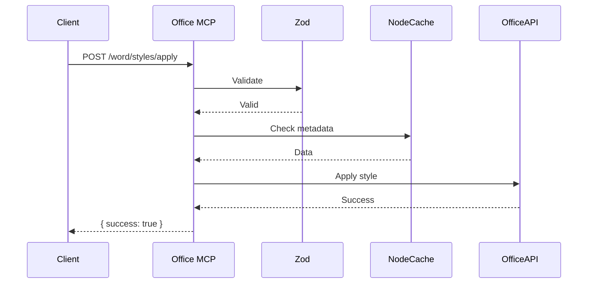

# Technical Details

Learn about the **Office MCP Server**’s implementation, testing, future plans, resources, and licensing.

## Table of Contents
- [Implementation](#implementation)
  - [Archive Handling](#archive-handling)
  - [Language Detection](#language-detection)
- [Testing and Reliability](#testing-and-reliability)
- [Future Improvements](#future-improvements)
  - [Cloud Document Access](#cloud-document-access)
- [Resources](#resources)
- [License](#license)

## Implementation
Built with **TypeScript** and **FastMCP** for robustness:
- **TypeScript**: Ensures type safety with interfaces for tools/parameters.
- **FastMCP**: Lightweight, AI-ready with features like `instructions`, `reportProgress`, `authenticate`, and `addPrompt`.

**Dependencies**:
- `@microsoft/office-js`: Cross-platform Office automation
- `markdown-it`, `mermaid`, `pdf-parse`, `pdf2pic`, `highlight.js`, `zod`, `winston`, `node-cache`, `jest`
- `adm-zip`: For handling ZIP archives.
- `node-7z`: For handling 7z archives (requires 7z executable in PATH).
- `@vscode/vscode-languagedetection`: For intelligent code language detection.
- `papaparse`: "^5.4.1" - For CSV parsing and unparsing.
- `jsonpath-plus`: "^7.2.0" - For querying JSON structures using JSONPath expressions.
- `cheerio`: "^1.0.0-rc.12" - For parsing and manipulating HTML/XML documents.

**Security**:
- `ALLOWED_FS_PATHS` restricts file access
- `zod` validates inputs
- Token-based `authenticate`
- Credential Guardian secures Office logins

**Performance**:
- `node-cache` for metadata
- Batch operations (`word/batch`)
- Streaming for large files

**Example**:


### Archive Handling
The server now includes tools for managing archive files under the `fs/archive/` path.
- **Supported Formats**: Currently supports listing, extracting, and creating for **ZIP** and **7z** formats. Read-only support for other formats (RAR, gz, tar, etc.) may be available depending on the capabilities of the installed 7z executable on the system.
- **Implementation Details**:
    - **ZIP**: Handled using the `adm-zip` Node.js library.
    - **7z**: Handled using the `node-7z` Node.js library, which interfaces with the system's 7z command-line executable. Creation of 7z archives is performed by spawning the `7z` command via Node.js's `child_process` module.

### Language Detection
Intelligent language detection has been integrated into the `word/code-format` tool.
- **Library Used**: `@vscode/vscode-languagedetection` is used to analyze text snippets and identify the programming language with high confidence.
- **Integration**: The `ModelOperations` class from the library is instantiated and its `runModel` method is used within the `detectLanguage` function of the `word/code-format` tool. This improves the accuracy of language detection compared to simple heuristic methods.

## Testing and Reliability
- **Unit Tests**: Isolate tools (`tests/unit/word/`)
- **Integration Tests**: Tool interactions (`tests/integration/`)
- **End-to-End Tests**: User workflows (`tests/e2e/`)
- **Performance Tests**: <10s for 100 pages
- **Security Tests**: Block malicious inputs

Run tests:
```bash
npm test
```
Coverage: >90% (`jest --coverage`).

## Future Improvements
- Real-time editing via WebSockets
- Cloud-native (Kubernetes/serverless)
- Deeper AI (NLP for summarization)
- Support for .odt/Google Docs
- Plugin system

### Cloud Document Access
Planned support for accessing and working with documents stored in Teams or Office 365 via their links.
- **Goal**: Enable the MCP server to interact with cloud documents on behalf of the user while respecting their permissions.
- **Proposed Approach**:
    - Utilize the **Microsoft Graph API** for accessing and manipulating files stored in SharePoint and OneDrive (which back Teams file storage).
    - Implement an **OAuth 2.0 authentication flow** to obtain delegated permissions from the user.
    - Investigate the **Office JavaScript API** for performing complex document manipulations in the web environment that may not be fully supported by the Graph API. This might require a dedicated web-based component orchestrated by the MCP server.
- **Architecture Sketch**:
```mermaid
graph TD
    A[User Request with Office 365/Teams Link] --> B{MCP Server};
    B --> C{Authentication Service};
    C -- OAuth 2.0 Flow --> D[Microsoft Identity Platform];
    D -- Tokens --> C;
    C -- Authenticated Request --> E[Microsoft Graph API];
    E -- File Content/Metadata --> B;
    B -- Process Document --> F[Office Tools (Word, Excel, PPT)];
    F -- COM/OLE (Desktop) / JS API (Web) --> G[Office Application (Desktop/Web)];
    G -- Result --> B;
    B --> H[Response to User];
```
This feature is a significant undertaking and is planned for a future development phase. More detailed planning and implementation will be required.

## Resources
- FastMCP: [x.ai/fastmcp](https://x.ai/fastmcp)
- Office APIs: [docs.microsoft.com/office/dev/add-ins](https://docs.microsoft.com/office/dev/add-ins)
- Markdown-it: [github.com/markdown-it/markdown-it](https://github.com/markdown-it/markdown-it)
- Mermaid: [mermaid-js.github.io](https://mermaid-js.github.io/)
- Highlight.js: [highlightjs.org](https://highlightjs.org/)
- `@vscode/vscode-languagedetection`: [github.com/microsoft/vscode-languagedetection](https://github.com/microsoft/vscode-languagedetection)
- `adm-zip`: [github.com/cthackers/adm-zip](https://github.com/cthackers/adm-zip)
- `node-7z`: [github.com/quentin-sommer/node-7z](https://github.com/quentin-sommer/node-7z)
- `papaparse`: [www.papaparse.com](https://www.papaparse.com)
- `jsonpath-plus`: [github.com/JSONPath-Plus/JSONPath](https://github.com/JSONPath-Plus/JSONPath)
- `cheerio`: [cheerio.js.org](https://cheerio.js.org/)
- API Docs: [docs/api](docs/api)
- GitHub: [github.com/dvdjg/mcp-office](https://github.com/dvdjg/mcp-office)

## License
**MIT License with Restrictions**

```
MIT License

Copyright (c) 2025 David Jurado

Permission is hereby granted, free of charge, to any person obtaining a copy
of this software and associated documentation files (the "Software"), to deal
in the Software without restriction, including without limitation the rights
to use, copy, modify, merge, publish, distribute, sublicense, and/or sell
copies of the Software, and to permit persons to whom the Software is
furnished to do so, subject to the following conditions:

The above copyright notice and this permission notice shall be included in all
copies or substantial portions of the Software.

THE SOFTWARE IS PROVIDED "AS IS", WITHOUT WARRANTY OF ANY KIND, EXPRESS OR
IMPLIED, INCLUDING BUT NOT LIMITED TO THE WARRANTIES OF MERCHANTABILITY,
FITNESS FOR A PARTICULAR PURPOSE AND NONINFRINGEMENT. IN NO EVENT SHALL THE
AUTHORS OR COPYRIGHT HOLDERS BE LIABLE FOR ANY CLAIM, DAMAGES OR OTHER
LIABILITY, WHETHER IN AN ACTION OF CONTRACT, TORT OR OTHERWISE, ARISING FROM,
OUT OF OR IN CONNECTION WITH THE SOFTWARE OR THE USE OR OTHER DEALINGS IN THE
SOFTWARE.
```

## Next Steps
- See [Installation & API](INSTALLATION_AND_API.md) for setup and tools.
- Explore [Use Cases](USE_CASES.md) for examples.
- Return to [README](README.md).