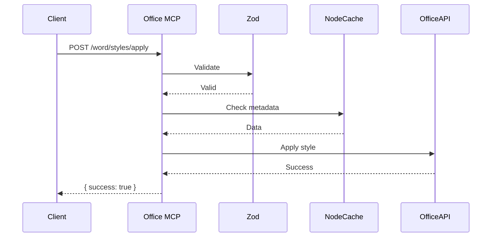

# Technical Details

Learn about the **Office MCP Server**’s implementation, testing, future plans, resources, and licensing.

## Table of Contents
- [Implementation](#implementation)
- [Testing and Reliability](#testing-and-reliability)
- [Future Improvements](#future-improvements)
- [Resources](#resources)
- [License](#license)

## Implementation
Built with **TypeScript** and **FastMCP** for robustness:
- **TypeScript**: Ensures type safety with interfaces for tools/parameters.
- **FastMCP**: Lightweight, AI-ready with features like `instructions`, `reportProgress`, `authenticate`, and `addPrompt`.

**Dependencies**:
- `@microsoft/office-js`: Cross-platform Office automation
- `markdown-it`, `mermaid`, `pdf-parse`, `pdf2pic`, `highlight.js`, `zod`, `winston`, `node-cache`, `jest`

**Security**:
- `ALLOWED_FS_PATHS` restricts file access
- `zod` validates inputs
- Token-based `authenticate`
- Credential Guardian secures Office logins

**Performance**:
- `node-cache` for metadata
- Batch operations (`word/batch`)
- Streaming for large files

**Example**:


## Testing and Reliability
- **Unit Tests**: Isolate tools (`tests/unit/word/`)
- **Integration Tests**: Tool interactions (`tests/integration/`)
- **End-to-End Tests**: User workflows (`tests/e2e/`)
- **Performance Tests**: <10s for 100 pages
- **Security Tests**: Block malicious inputs

Run tests:
```bash
npm test
```
Coverage: >90% (`jest --coverage`).

## Future Improvements
- Real-time editing via WebSockets
- Cloud-native (Kubernetes/serverless)
- Deeper AI (NLP for summarization)
- Support for .odt/Google Docs
- Plugin system
- ZIP file tools (`fs/archive`)

Suggest features on [GitHub](https://github.com/dvdjg/mcp-office/issues).

## Resources
- FastMCP: [x.ai/fastmcp](https://x.ai/fastmcp)
- Office APIs: [docs.microsoft.com/office/dev/add-ins](https://docs.microsoft.com/office/dev/add-ins)
- Markdown-it: [github.com/markdown-it/markdown-it](https://github.com/markdown-it/markdown-it)
- Mermaid: [mermaid-js.github.io](https://mermaid-js.github.io/)
- Highlight.js: [highlightjs.org](https://highlightjs.org/)
- API Docs: [docs/api](docs/api)
- GitHub: [github.com/dvdjg/mcp-office](https://github.com/dvdjg/mcp-office)

## License
**MIT License with Restrictions**

```
MIT License

Copyright (c) 2025 David Jurado

Permission is hereby granted, free of charge, to any person obtaining a copy
of this software and associated documentation files (the "Software"), to deal
in the Software without restriction, including without limitation the rights
to use, copy, modify, merge, publish, distribute, sublicense, and/or sell
copies of the Software, and to permit persons to whom the Software is
furnished to do so, subject to the following conditions:

The above copyright notice and this permission notice shall be included in all
copies or substantial portions of the Software.

THE SOFTWARE IS PROVIDED "AS IS", WITHOUT WARRANTY OF ANY KIND, EXPRESS OR
IMPLIED, INCLUDING BUT NOT LIMITED TO THE WARRANTIES OF MERCHANTABILITY,
FITNESS FOR A PARTICULAR PURPOSE AND NONINFRINGEMENT. IN NO EVENT SHALL THE
AUTHORS OR COPYRIGHT HOLDERS BE LIABLE FOR ANY CLAIM, DAMAGES OR OTHER
LIABILITY, WHETHER IN AN ACTION OF CONTRACT, TORT OR OTHERWISE, ARISING FROM,
OUT OF OR IN CONNECTION WITH THE SOFTWARE OR THE USE OR OTHER DEALINGS IN THE
SOFTWARE.
```

## Next Steps
- See [Installation & API](INSTALLATION_AND_API.md) for setup and tools.
- Explore [Use Cases](USE_CASES.md) for examples.
- Return to [README](README.md).