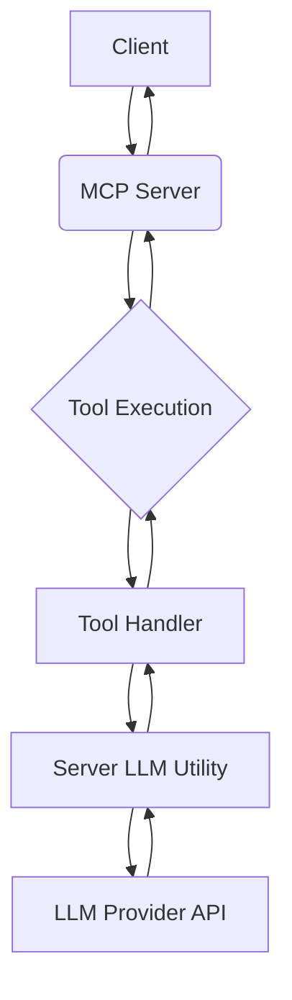
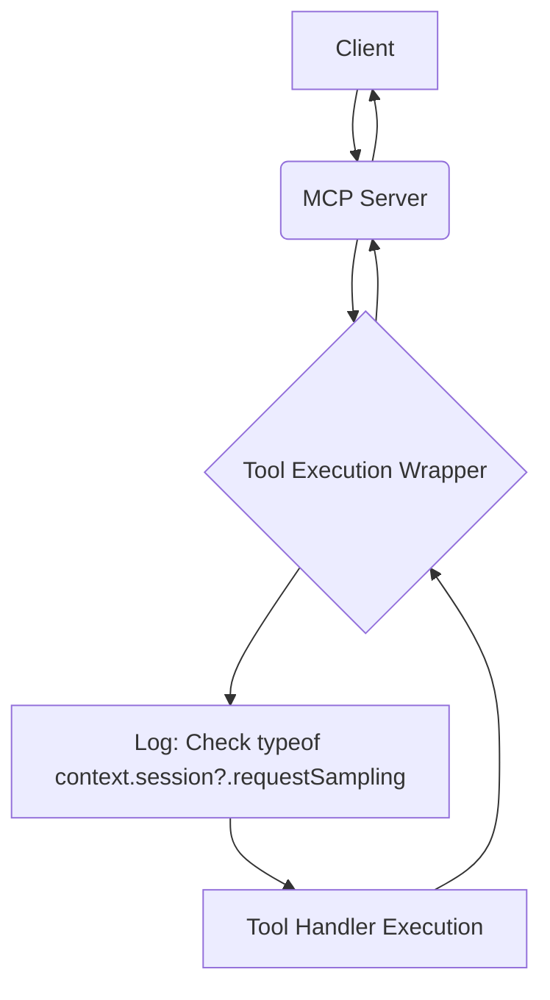

# Plan: Implement Server-Side LLM Integration and Add Logging

This plan outlines the steps to integrate LLM capabilities directly into the Office MCP server as an alternative to relying on client-side sampling, and to add logging related to the availability of the `requestSampling` function.

**1. Confirm Client Limitation**

*   The "Method not found" error when calling `session.requestSampling` in the `connect` handler confirms that the client currently in use does not support the FastMCP `sampling/createMessage` method. This aligns with the FastMCP documentation indicating that the Claude Desktop client does not yet support this feature.
*   The `requestSampling` method is intended to be used during tool execution, not within connection handlers.

**2. Implement Server-Side LLM Integration**

Since client-side sampling is not available, the most viable approach is for the MCP server to make direct API calls to an LLM provider.

*   **Goal:** Enable tools like `generateAndInsertText` to use LLM capabilities by making API calls from the server.
*   **Implementation Steps:**
    *   **Configuration:** Add configuration options to the server for the chosen LLM provider. This should include the API endpoint and the API key. Environment variables are a secure way to manage these credentials (e.g., `LLM_PROVIDER_API_KEY`, `LLM_PROVIDER_ENDPOINT`, `LLM_MODEL_NAME`).
    *   **LLM Utility Module:** Create a new TypeScript file (e.g., `src/utils/llmClient.ts`) that will contain the logic for interacting with the LLM provider's API. This module will:
        *   Import necessary libraries (e.g., `axios` for HTTP requests, or a specific SDK for the LLM provider).
        *   Read the LLM configuration from environment variables.
        *   Export a function (e.g., `generateText`) that takes a prompt and optional parameters (like `maxTokens`) and makes the API call to the LLM provider.
        *   Handle the API response and return the generated text.
        *   Include error handling for API call failures.
    *   **Modify Tools:** Update the handlers of tools that require LLM access (specifically `src/tools/word/generateAndInsertText.tool.ts`) to use the new `llmClient` utility function instead of `context.session.requestSampling`.
    *   **Update Error Handling:** Ensure that the tool handlers correctly catch and handle errors that might occur during the server-side LLM API calls, providing informative error responses.

Here's a simplified diagram illustrating this alternative flow:

**3. Add Logging for `requestSampling` Availability**

Add a log entry in `src/server/index.ts` to check and report whether the `requestSampling` function is available on the session provided to the tool execution context.

*   **Goal:** Gain visibility into which client sessions provide the sampling capability.
*   **Implementation:** Insert a log statement within the `execute` function wrapper for tools in `src/server/index.ts` (around line 160, before the `try` block) to check `typeof context.session?.requestSampling`.

Here's a diagram showing the proposed logging within the tool execution flow:

**4. Remove Connect Handler Test Call**

The attempt to call `session.requestSampling` within the `connect` handler in `src/server/index.ts` resulted in a "Method not found" error and is not the correct usage pattern for this method.

*   **Goal:** Clean up the code and remove the incorrect usage.
*   **Implementation:** Remove the code block within the `mcpServer.on("connect", ...)` handler that attempts to call `event.session.requestSampling`. The `connect` handler itself can remain if it's used for other purposes.

**Next Steps:**

Once this plan is approved, we will switch to a mode suitable for implementing these code changes.